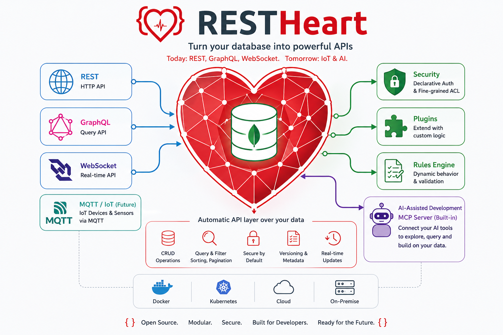

#  RESTHeart

**The Backend Framework with MongoDB Data APIs.**

[](https://github.com/SoftInstigate/restheart/commits/master)
[](https://github.com/SoftInstigate/restheart/actions/workflows/branch.yml)
[](https://github.com/SoftInstigate/restheart)
[](https://central.sonatype.com/namespace/org.restheart)
[](https://javadoc.io/doc/org.restheart/restheart-commons)
[](https://hub.docker.com/r/softinstigate/restheart/)
[](https://join.slack.com/t/restheart/shared_invite/zt-1olrhtoq8-5DdYLBWYDonFGEALhmgSXQ)

---

# What is RESTHeart?

RESTHeart is a complete backend framework for MongoDB. It instantly exposes REST, GraphQL, WebSocket, and SSE APIs with zero server code required. Authentication, authorization, and real-time updates included.



**Ship a working backend in hours, not days.** You configure, not code. Write plugins only when you need custom business logic, in Java, Kotlin, JavaScript, or TypeScript.

**Built for AI-assisted development.** Connect Claude Code, Cursor, or VS Code directly to RESTHeart's live MCP server via [Sophia](https://restheart.org/docs/cloud/sophia/mcp) and get accurate, real-time knowledge of every API and plugin pattern while you build.

Available as a **Docker** image and **GraalVM** native binary. Built on Java 25, Undertow, and virtual threads.

**Core capabilities:**

- **REST API**: Full CRUD, aggregations, filtering, sorting, pagination
- **GraphQL**: Schema-driven mapping to MongoDB queries
- **WebSocket**: Real-time change streams and data sync
- **SSE**: Server-Sent Events for live dashboards, IoT feeds, and event streams
- **IoT / MQTT**: Connect devices and ingest telemetry directly into MongoDB *(coming soon)*
- **Authentication and Authorization**: JWT, OAuth2, LDAP, MongoDB-based users, ACL rules
- **Plugin system**: Extend with Java, Kotlin, JavaScript, or TypeScript for custom business logic
- **MCP server (Sophia)**: AI clients access RESTHeart docs and plugin API directly from your IDE

---

## Quick Start

```bash
# Start MongoDB + RESTHeart with Docker Compose
curl https://raw.githubusercontent.com/SoftInstigate/restheart/master/docker-compose.yml \
  --output docker-compose.yml && docker compose up --attach restheart

# Test it
curl http://localhost:8080/ping
```

Default credentials: `admin` / `secret` (change in production)

More options: https://restheart.org/docs/foundations/quick-start

---

## Example: Query MongoDB via HTTP

```javascript
const url = encodeURI('https://demo.restheart.org/messages?filter={"from":"Bob"}&pagesize=1');

fetch(url)
  .then(response => response.json())
  .then(json => console.log(JSON.stringify(json, null, 2)));
```

That's it. No Express routes, no Mongoose schemas, no middleware setup.

📄 Full documentation: https://restheart.org/docs/

---

## Use Cases

- **API development without boilerplate**: Skip CRUD code, focus on business logic
- **Mobile and web backends**: Get REST/GraphQL APIs immediately
- **Real-time applications**: WebSocket and SSE for chat, notifications, and live dashboards
- **AI-assisted development**: Use Sophia MCP to let your AI coding assistant build against RESTHeart directly
- **IoT backends**: Collect and store sensor data via MQTT, query it via REST *(coming soon)*
- **MongoDB Data API replacement**: Self-hosted alternative to the deprecated Atlas Data API ([migration guide](https://www.softinstigate.com/en/blog/posts/mongodb-deprecates-data-api/))
- **Legacy modernization**: Add modern APIs to existing MongoDB databases
- **PostgreSQL with MongoDB API**: Use via FerretDB for PostgreSQL storage ([tutorial](https://www.softinstigate.com/en/blog/posts/ferretdb-tutorial/))

---

## Extend with Plugins

Write custom logic only when you need it. RESTHeart handles the rest.

### Java Plugin

```java
@RegisterPlugin(name = "greetings")
public class GreeterService implements JsonService {
    @Override
    public void handle(JsonRequest req, JsonResponse res) {
        res.setContent(object()
            .put("message", "Hello World!")
            .put("timestamp", Instant.now()));
    }
}
```

### JavaScript Plugin

```javascript
export const options = {
    name: "greetings",
    uri: "/greetings"
}

export function handle(request, response) {
    response.setContent(JSON.stringify({
        message: 'Hello World!',
        timestamp: new Date().toISOString()
    }));
    response.setContentTypeAsJson();
}
```

**Plugin types:**

- **Services**: custom REST endpoints
- **Interceptors**: modify requests and responses, add validation
- **Initializers**: run code at startup
- **Providers**: dependency injection

📖 Plugin development: https://restheart.org/docs/plugins/overview/

🔧 Use [restheart-cli](https://github.com/SoftInstigate/restheart-cli) for scaffolding, testing, and hot-reload.

---

## Deployment

### Docker

```bash
docker pull softinstigate/restheart:latest

docker run -p 8080:8080 \
  -v ./restheart.yml:/opt/restheart/etc/restheart.yml \
  softinstigate/restheart
```

### Kubernetes

Stateless architecture supports horizontal scaling. Configure with ConfigMaps and Secrets.

### Native Executables

Prebuilt binaries for macOS, Linux, and Windows with faster startup and lower memory footprint.

See [docs/native-executables.md](docs/native-executables.md) for download links.

### RESTHeart Cloud

Fully managed service: [cloud.restheart.com](https://cloud.restheart.com)

- Instant provisioning
- Automatic scaling
- Free tier available
- Premium plugins (Webhooks, Sophia AI, Facet)

---

## Database Compatibility

| Database              | Support Level | Notes                                                                                          |
| --------------------- | ------------- | ---------------------------------------------------------------------------------------------- |
| ✅ **MongoDB**         | Full          | All versions 3.6+                                                                              |
| ✅ **MongoDB Atlas**   | Full          | Cloud-native support                                                                           |
| ✅ **Percona Server**  | Full          | Drop-in MongoDB replacement                                                                    |
| ⚙️ **FerretDB**        | Partial       | PostgreSQL-backed ([tutorial](https://www.softinstigate.com/en/blog/posts/ferretdb-tutorial/)) |
| ⚙️ **AWS DocumentDB**  | Partial       | Most features work                                                                             |
| ⚙️ **Azure Cosmos DB** | Partial       | MongoDB API compatibility layer                                                                |

---

## Community and Support

- 📄 **[Documentation](https://restheart.org/docs/)**: API reference and guides
- 🤖 **[Ask Sophia](https://sophia.restheart.com)**: AI documentation assistant
- 💬 **[Slack](https://join.slack.com/t/restheart/shared_invite/zt-1olrhtoq8-5DdYLBWYDonFGEALhmgSXQ)**: Community chat
- 🐛 **[GitHub Issues](https://github.com/SoftInstigate/restheart/issues/new)**: Bug reports and feature requests
- 💡 **[Stack Overflow](https://stackoverflow.com/questions/ask?tags=restheart)**: Tag `restheart`

---

## Contributing

Contributions welcome. RESTHeart is open source (AGPL).

- Report bugs and request features via GitHub Issues
- Submit pull requests
- Improve documentation
- Share use cases

See [CONTRIBUTING.md](CONTRIBUTING.md) for guidelines.

---

## License

RESTHeart core is licensed under the **GNU AGPL v3**.

The plugin SDK (`restheart-commons`, Maven artifact `org.restheart:restheart-commons`) is licensed under the **Apache License 2.0**. Plugins and extensions that depend only on `restheart-commons` are not subject to the AGPL v3 and may be distributed under any license you choose, including proprietary licenses. This follows the same pattern used by MongoDB: the server is AGPL, the drivers and SDKs are Apache 2.0.

See [PLUGIN_EXCEPTION](PLUGIN_EXCEPTION.md) for the formal terms of this permission.

**Commercial license**: If you need to modify RESTHeart core without open-sourcing your changes, commercial licenses are available. See [restheart.com/on-premises](https://restheart.com/on-premises/).

---

_Built with ❤️ by [SoftInstigate](https://www.softinstigate.com) | [GitHub](https://github.com/SoftInstigate/restheart) | [Website](https://restheart.org) | [Cloud](https://cloud.restheart.com)_

---

<div align="center">

</div>