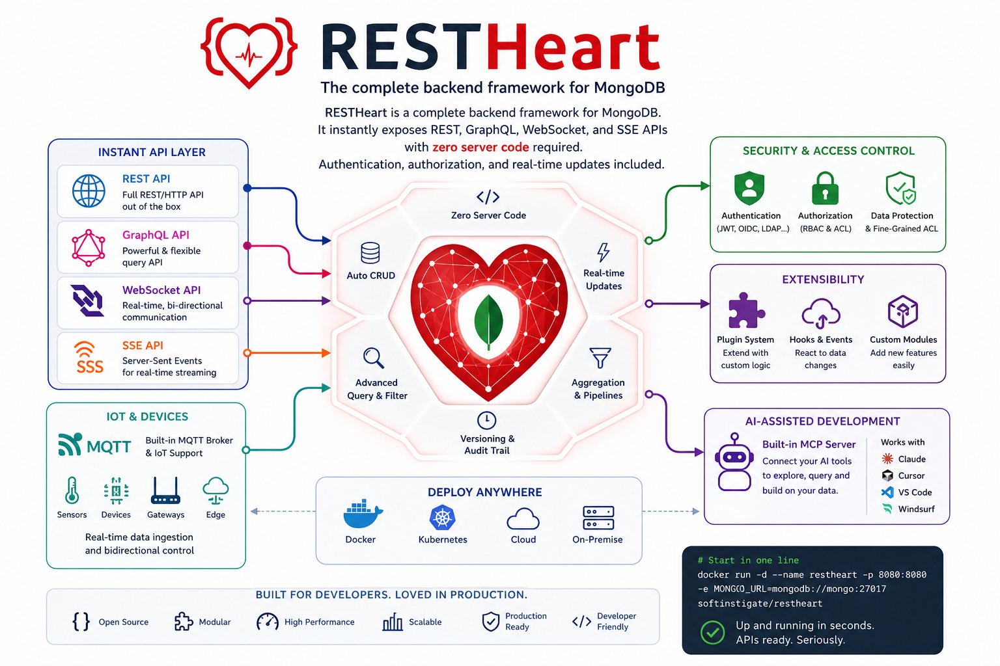

#  RESTHeart

[](https://github.com/SoftInstigate/restheart/commits/master)
[](https://github.com/SoftInstigate/restheart/actions/workflows/branch.yml)
[](https://github.com/SoftInstigate/restheart)
[](https://central.sonatype.com/namespace/org.restheart)
[](https://javadoc.io/doc/org.restheart/restheart-commons)
[](https://hub.docker.com/r/softinstigate/restheart/)
[](https://join.slack.com/t/restheart/shared_invite/zt-1olrhtoq8-5DdYLBWYDonFGEALhmgSXQ)
[](https://cla-assistant.io/SoftInstigate/restheart)

---

## What RESTHeart is

Every application built on MongoDB ends up with the same backend layer: routes that map to collections, permission checks on each endpoint, pagination and filtering logic, a way to push updates to clients in real time. That layer is largely mechanical, and writing it by hand for each project is where a lot of backend code goes.

RESTHeart generates that layer directly from the database. Point it at a MongoDB instance and it exposes the data through REST, GraphQL, WebSocket, and SSE APIs, with authentication, authorization, and real-time change streams already in place. Permissions and behavior are configured declaratively; custom logic is added only for the parts a data API cannot express, through plugins written in Java, Kotlin, JavaScript, or TypeScript.



### Example

```bash
curl "https://demo.restheart.org/messages?filter={\"from\":\"Bob\"}&pagesize=1"
```

No route was written for `/messages`. It is a MongoDB collection, and the query parameters (`filter`, `pagesize`, sorting) map directly to MongoDB's query language.

### Core capabilities

- [**REST API**](https://restheart.org/docs/mongodb-rest/): full CRUD, aggregations, filtering, sorting, pagination, generated from the database schema
- [**GraphQL**](https://restheart.org/docs/graphql/): schema-driven mapping to MongoDB queries
- [**WebSocket**](https://restheart.org/docs/websocket/): change streams exposed as real-time data sync
- [**SSE**](https://restheart.org/docs/sse/): Server-Sent Events for dashboards, IoT feeds, and event streams
- [**Authentication and Authorization**](https://restheart.org/docs/security/overview): JWT, OAuth2, LDAP, MongoDB-based users, ACL rules defined as data, not code
- [**Plugin framework**](https://restheart.org/docs/framework/overview): custom services, interceptors, and initializers in Java, Kotlin, JavaScript, or TypeScript, for the logic a declarative API cannot cover
- **Sophia AI assistant**: an MCP server exposing RESTHeart's own API and plugin documentation to AI coding assistants such as Claude Code, Cursor, or VS Code, and a browser chat for querying the docs directly
- **Metrics and monitoring**: a Prometheus-compatible endpoint plus a browser dashboard at `/metrics-ui`, tracking request rates, latency percentiles, and HTTP status distribution
- **IoT / MQTT**: ingest device telemetry directly into MongoDB *(coming soon)*

Distributed as a Docker image and a GraalVM native binary. Built on Java 25, Undertow, and virtual threads.

### Running it

Fully managed, no installation required:

[](https://cloud.restheart.com/signup)

Or self-hosted, since the core is free and open source:

```bash
curl https://raw.githubusercontent.com/SoftInstigate/restheart/master/docker-compose.yml \
  --output docker-compose.yml && docker compose up --attach restheart

curl http://localhost:8080/ping
```

Full documentation: https://restheart.org/docs/

---
