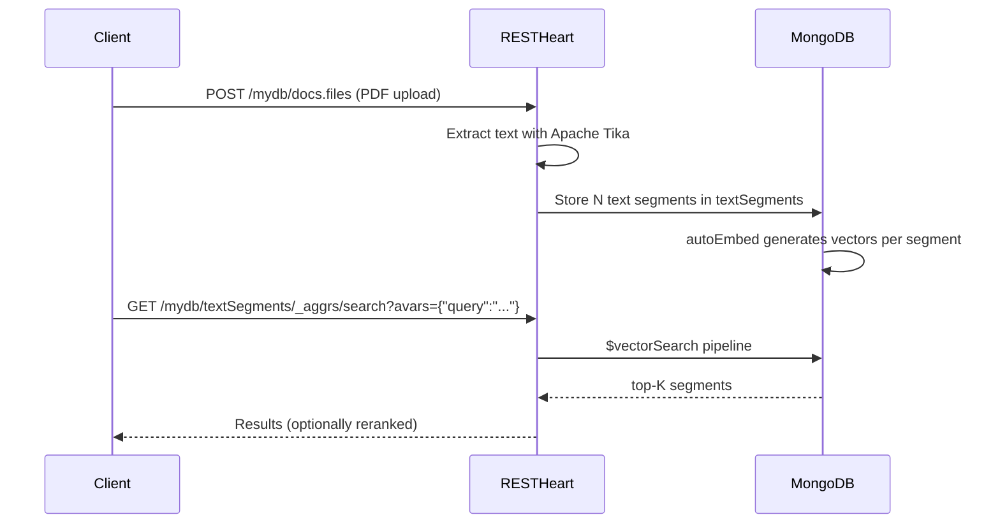
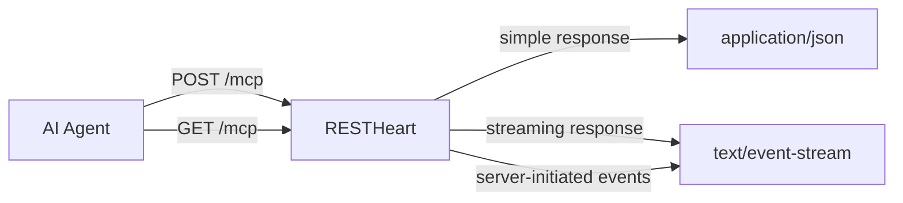

# RESTHeart AI

Make Your MongoDB Backend **AI-Ready**

<div class="abs-br m-6 text-xl opacity-60">
  RESTHeart 10.0
</div>

---
layout: center
class: text-center
---

# The Challenge

AI agents and LLMs need **data** — your data

<div class="grid grid-cols-3 gap-8 mt-12 text-left">
  <div class="p-6 rounded-xl border border-primary/30 bg-primary/5">
    <div class="text-3xl mb-3">🔍</div>
    <h3 class="font-bold mb-2">Semantic Search</h3>
    <p class="text-sm opacity-70">Users expect search that understands meaning, not just keywords</p>
  </div>
  <div class="p-6 rounded-xl border border-primary/30 bg-primary/5">
    <div class="text-3xl mb-3">🤖</div>
    <h3 class="font-bold mb-2">AI Agents</h3>
    <p class="text-sm opacity-70">LLM agents need to query, read, and update your MongoDB data</p>
  </div>
  <div class="p-6 rounded-xl border border-primary/30 bg-primary/5">
    <div class="text-3xl mb-3">📄</div>
    <h3 class="font-bold mb-2">RAG Pipelines</h3>
    <p class="text-sm opacity-70">Retrieval-Augmented Generation requires chunking and indexing your documents</p>
  </div>
</div>

---
layout: center
class: text-center
---

# Sophia AI

**Your docs, turned into a conversational assistant**

<div class="grid grid-cols-3 gap-6 mt-10 text-left text-sm">
  <div class="p-5 rounded-xl border border-primary/30 bg-primary/5">
    <div class="text-3xl mb-3">📄</div>
    <h3 class="font-bold mb-2">Upload your docs</h3>
    <p class="opacity-70">PDF, Markdown, HTML, Word, spreadsheets — any format. No reformatting needed.</p>
  </div>
  <div class="p-5 rounded-xl border border-primary/30 bg-primary/5">
    <div class="text-3xl mb-3">🔍</div>
    <h3 class="font-bold mb-2">Semantic RAG</h3>
    <p class="opacity-70">RESTHeart indexes your content with vector search. Sophia finds the right passage, not just keywords.</p>
  </div>
  <div class="p-5 rounded-xl border border-primary/30 bg-primary/5">
    <div class="text-3xl mb-3">💬</div>
    <h3 class="font-bold mb-2">Conversational answers</h3>
    <p class="opacity-70">Powered by Claude (Anthropic) + AWS Bedrock. Every answer cites the source document.</p>
  </div>
</div>

<div class="mt-8 opacity-60 text-sm">
  Built on RESTHeart Cloud · Available at <strong>bysophia.ai</strong>
</div>

---
layout: two-cols
layoutClass: gap-8
class: text-sm
---

# Sophia AI — Features

**Already live in production:**

- **MCP server** — Claude Desktop, Claude Code, Cursor and any MCP client can query Sophia directly
- **Multi-tenant** — each customer self-administers their own agents and users
- **Invite-based onboarding** — admins invite users via email
- **Role-based access** — tag-level content isolation per role
- **Model profiles** — route cheap phases to smaller models: **60–70% cost reduction** per turn
- **Search preamble** — pre-executes retrieval before the agent loop: **76% fewer input tokens**
- **Prompt caching** — ~1/10 the cost on cached content
- **Agent-managed memory** — agent decides what to remember

::right::

<div class="mt-2">

**Two public instances — try them now:**

```
bysophia.ai/agents/restheart   ← RESTHeart docs
bysophia.ai/agents/cloud       ← RESTHeart Cloud docs
```

Both are also MCP servers for Claude Desktop / Claude Code.

**Pricing:**

| | |
|---|---|
| First agent | €150 / month |
| Additional agents | €100 / month |
| Infrastructure, updates & support | included |

**Enterprise:** bundles of 5, 20, or unlimited agents with SLA.

</div>

---
layout: center
---

# RESTHeart AI — The Plan

Sophia already ships these features in production.
**`restheart-ai` ports the foundations into RESTHeart OSS.**

<div class="grid grid-cols-4 gap-4 mt-8 text-center text-sm">
  <div class="p-4 rounded-xl bg-green-500/10 border border-green-500/30">
    <div class="text-2xl mb-2">✅</div>
    <div class="font-bold text-green-400">OAuth 2.0</div>
    <div class="opacity-60 mt-1">Done</div>
  </div>
  <div class="p-4 rounded-xl bg-blue-500/10 border border-blue-500/30">
    <div class="text-2xl mb-2">🔵</div>
    <div class="font-bold text-blue-400">Vector Search</div>
    <div class="opacity-60 mt-1">Phase 1</div>
  </div>
  <div class="p-4 rounded-xl bg-purple-500/10 border border-purple-500/30">
    <div class="text-2xl mb-2">🔷</div>
    <div class="font-bold text-purple-400">AI Providers</div>
    <div class="opacity-60 mt-1">Phase 2</div>
  </div>
  <div class="p-4 rounded-xl bg-orange-500/10 border border-orange-500/30">
    <div class="text-2xl mb-2">🟠</div>
    <div class="font-bold text-orange-400">MCP Server</div>
    <div class="opacity-60 mt-1">v1 → v3</div>
  </div>
</div>

---
layout: two-cols
layoutClass: gap-8
class: text-sm
---

# OAuth 2.0 ✅
### Already Shipped

RESTHeart now exposes a **standards-compliant** auth stack — the prerequisite for MCP and any OAuth 2.0 client.

**What changed:**

- Dedicated `/token` endpoint (RFC 6749)
- `grant_type=password` and `client_credentials`
- Auto-discovery at `/.well-known/oauth-authorization-server` (RFC 8414)
- Protected resource metadata `/.well-known/oauth-protected-resource` — required by **MCP OAuth 2.1** (RFC 9728)
- JWT by default, HttpOnly cookie support

::right::

```http
POST /token
Content-Type: application/x-www-form-urlencoded

grant_type=password&username=alice&password=s3cret

HTTP/1.1 200 OK
{
  "access_token": "eyJhbGci...",
  "token_type": "Bearer",
  "expires_in": 900
}
```

```http
# Machine-to-machine (client_credentials)
POST /token
Content-Type: application/x-www-form-urlencoded

grant_type=client_credentials
&client_id=my-service&client_secret=s3cret
```

---
layout: two-cols
layoutClass: gap-8
class: text-sm
---

# Phase 1 — Vector Search
### Porting from Sophia to RESTHeart OSS

New optional plugin: **`restheart-ai`**.

**No embedding pipeline needed** — MongoDB's `autoEmbed` generates vectors automatically with Voyage AI (Atlas and Community Edition 8.2+).

**What Phase 1 adds:**

- **Vector index management** via `/_indexes`
- **Document chunking** — upload PDF, Word, HTML; RESTHeart extracts text (Apache Tika) and stores segments
- **Reranking** — Atlas Reranking API refines results

::right::

```bash
# Create an autoEmbed index
PUT /mydb/articles/_indexes/vectors
{
  "type": "vectorSearch",
  "definition": { "fields": [{
    "type": "autoEmbed",
    "path": "description",
    "modelName": "voyage-4-lite",
    "similarity": "cosine"
  }]}
}
```

```bash
# Search — MongoDB generates the query vector
GET /mydb/articles/_aggrs/search
    ?avars={"query":"machine learning for NLP"}
```

---
layout: center
class: text-center
---

# RAG in 4 Steps — Upload → Chunk → Embed → Search



---
layout: two-cols
layoutClass: gap-8
class: text-sm
---

# Phase 2 — Pluggable Providers
### Sophia uses this today — coming to OSS

When `autoEmbed` is not available — or you need a specific model.

**Embedding Providers:**

| Provider | Type |
|----------|------|
| OpenAI | Cloud |
| Voyage AI | Cloud |
| AWS Bedrock | Cloud |
| Ollama | Local |

**Reranking:** Cohere · Voyage AI · Bedrock

::right::

```yaml
plugins-args:
  aiActivator:
    embedding-provider: openAIEmbeddingProvider
    rerank-provider: cohereRerankProvider
  openAIEmbeddingProvider:
    api-key: "sk-proj-..."
    model: text-embedding-3-small
```

```bash
# $vectorize: text → vector inside any aggregation pipeline
# { "queryVector": { "$vectorize": { "$var": "query" } } }
# RESTHeart calls the embedding provider before hitting MongoDB

GET /mydb/articles/_aggrs/search
    ?avars={"query":"machine learning for NLP"}
```

```bash
# Auto-embedding on write — zero client changes needed
POST /mydb/articles
{ "title": "My Article", "description": "Vector search intro" }
# → stored with embedding[] populated automatically
```

---
layout: two-cols
layoutClass: gap-8
class: text-sm
---

# MCP Server — v1
### Sophia ships this today — porting to OSS

RESTHeart already exposes a full REST API.
**The MCP server doesn't reimplment it — it teaches the agent how to use it.**

Two lightweight MCP tools act as a navigation layer:

- **`mcp_discover`** — "what resources are available?" Returns a catalog of collections, aggregations, GraphQL apps and their descriptions. Pass a resource URI to get its full context.
- **`how_to_call`** — "how do I call this resource?" Returns a precise call descriptor: method, URI, parameters, body schema. The agent then makes the HTTP call directly to RESTHeart.

No data flows through the MCP tools. No API duplication. RESTHeart's existing endpoints stay the source of truth.

::right::

```
① Agent → mcp_discover()
  ← [
      { uri: "/mydb/articles",
        description: "Technical articles collection" },
      { uri: "/mydb/articles/_aggrs/search",
        description: "Semantic search over articles" },
      ...
    ]

② Agent → how_to_call("/mydb/articles/_aggrs/search")
  ← { method: "GET",
      uri: "/mydb/articles/_aggrs/search",
      params: { query: "string (required)",
                limit: "int (default 10)" } }

③ Agent → GET /mydb/articles/_aggrs/search
               ?avars={"query":"vector databases"}
  ← [ { title: "...", description: "..." }, ... ]
```

<div class="mt-3 p-2 rounded border border-primary/30 bg-primary/5 text-xs opacity-80">
  Steps ① and ② use MCP. Step ③ is a plain HTTP call to RESTHeart's existing API.
</div>

---
layout: two-cols
layoutClass: gap-8
class: text-sm
---

# `McpAware` — How It Works

Any RESTHeart plugin becomes an MCP resource by implementing `McpAware` and declaring `mcp = true`.

`McpAware` has **only default methods** — no override required. The default `describeMcp()` builds the resource descriptor from `@RegisterPlugin` metadata, deep-merged with any `mcp-config` block in the plugin's YAML configuration.

**Override `describeMcp()` only** when you need dynamic resource descriptions (e.g. one entry per MongoDB collection).

::right::

```java
// Minimal — zero overrides needed
@RegisterPlugin(
  name = "mySearch",
  description = "Full-text search over articles",
  defaultURI = "/articles/search",
  mcp = true   // ← opt in to MCP
)
public class MySearchService
    implements JsonService, McpAware {

  @Override
  public void handle(JsonRequest req,
                     JsonResponse res) { ... }
  // describeMcp() inherited — uses @RegisterPlugin metadata
}
```

```java
// Dynamic — one MCP resource per collection
@RegisterPlugin(name = "mongoService", mcp = true)
public class MongoService
    implements Service, McpAware {

  @Override
  public McpResource describeMcp(String collection) {
    var meta = readCollectionMetadata(collection);
    return McpResource.of(collection, meta.description());
  }
}
```

---
layout: two-cols
layoutClass: gap-8
class: text-sm
---

# MCP Server — v2
### MongoDB as MCP

`MongoService` and `GraphQLService` implement `McpAware` — every collection, aggregation, change stream, and GraphQL app becomes an MCP resource automatically.

**Agents can:**
- Discover collections from metadata descriptions
- Query documents via REST parameters
- Execute predefined aggregations
- Subscribe to change streams
- Run GraphQL queries

**Zero configuration needed.**

::right::

```
# Agent sees via mcp_discover:

Resource: /mydb/articles
  → "Collection of technical articles"
  → Supports: list, get, search

Resource: /mydb/articles/_aggrs/search
  → "Semantic search over articles"
  → Parameters: query (string), limit (int)

Resource: /mydb.graphql/blog
  → "GraphQL API for the blog"
  → Supports: queries and mutations
```

---
layout: two-cols
layoutClass: gap-8
class: text-sm
---

# MCP Server — v3
### MCP `resources` Primitive

Builds on v2: MongoDB collections become first-class **MCP resources** — not just tools.

**What v3 adds:**
- `resources/list` — visual picker in Claude Desktop, Cursor, VS Code
- `resources/read` — documents loaded directly into agent context
- `resources/subscribe` — real-time notifications on data changes
- **Resource Templates** (RFC 6570) — construct URIs without listing first

::right::

```json
// MCP capabilities at initialize:
{
  "capabilities": {
    "tools": { "listChanged": true },
    "resources": { "subscribe": true, "listChanged": true }
  }
}
```

```bash
# Read documents into agent context:
resources/read
  uri: /mydb/articles?filter={"status":"published"}

# Subscribe to real-time changes:
resources/subscribe
  uri: /mydb/orders
  → notifications/resources/updated on every write
```

---
layout: center
class: text-sm
---

# Streamable HTTP Transport

MCP 2025-03-26 replaced HTTP+SSE with **Streamable HTTP** — one endpoint, server decides JSON or SSE per-request.



<div class="grid grid-cols-2 gap-6 mt-4 text-left">
<div class="p-3 rounded-xl border border-gray-500/30">

**Classic HTTP+SSE** (deprecated)
```
GET  /sse       → always open event stream
POST /messages  → separate endpoint
```

</div>
<div class="p-3 rounded-xl border border-primary/30 bg-primary/5">

**Streamable HTTP** (MCP 2025-03-26)
```
POST /mcp → JSON or SSE (server decides)
GET  /mcp → optional server-push
```

</div>
</div>

---
layout: center
---

# Roadmap

<div class="grid grid-cols-4 gap-4 text-xs">

<div class="text-center">
  <div class="text-2xl mb-3">✅</div>
  <div class="font-bold text-green-400 mb-2">Done</div>
  <ul class="text-left opacity-80 space-y-1">
    <li>OAuth 2.0 /token</li>
    <li>RFC 8414 discovery</li>
    <li>RFC 9728 (MCP OAuth)</li>
    <li>restheart-ai module</li>
    <li>Vector search indexes</li>
    <li>Document chunking</li>
    <li>Atlas reranking</li>
    <li>SSE transport</li>
  </ul>
</div>

<div class="text-center">
  <div class="text-2xl mb-3">🔵</div>
  <div class="font-bold text-blue-400 mb-2">Phase 1</div>
  <ul class="text-left opacity-80 space-y-1">
    <li>MCP Server v1</li>
    <li>mcp_discover tool</li>
    <li>how_to_call tool</li>
    <li>McpAware interface</li>
    <li>Streamable HTTP</li>
  </ul>
</div>

<div class="text-center">
  <div class="text-2xl mb-3">🔷</div>
  <div class="font-bold text-purple-400 mb-2">Phase 2</div>
  <ul class="text-left opacity-80 space-y-1">
    <li>LangChain4j providers</li>
    <li>$vectorize operator</li>
    <li>Auto-embedding on write</li>
    <li>Pluggable reranking</li>
    <li>MCP Server v2</li>
    <li>MongoDB as MCP</li>
  </ul>
</div>

<div class="text-center">
  <div class="text-2xl mb-3">🟠</div>
  <div class="font-bold text-orange-400 mb-2">Phase 3</div>
  <ul class="text-left opacity-80 space-y-1">
    <li>MCP Server v3</li>
    <li>resources/list</li>
    <li>resources/read</li>
    <li>resources/subscribe</li>
    <li>Resource Templates</li>
  </ul>
</div>

</div>

---
layout: center
class: text-center
---

# Summary

RESTHeart 10.0 makes your MongoDB backend **natively AI-ready**

<div class="grid grid-cols-2 gap-6 mt-10 text-left text-sm">

<div class="p-5 rounded-xl border border-primary/30 bg-primary/5">
  <h3 class="font-bold mb-3 text-base">For your data</h3>
  <ul class="space-y-2 opacity-80">
    <li>✓ Vector search indexes on any collection</li>
    <li>✓ RAG-ready document chunking (PDF, Word, HTML...)</li>
    <li>✓ Semantic search without an external pipeline</li>
    <li>✓ Bring your own embedding model (Phase 2)</li>
  </ul>
</div>

<div class="p-5 rounded-xl border border-primary/30 bg-primary/5">
  <h3 class="font-bold mb-3 text-base">For your agents</h3>
  <ul class="space-y-2 opacity-80">
    <li>✓ MCP server — Claude, Cursor, VS Code, any MCP client</li>
    <li>✓ Every collection exposed as an MCP resource</li>
    <li>✓ OAuth 2.1 compliant (RFC 8414 + RFC 9728)</li>
    <li>✓ Streamable HTTP transport</li>
  </ul>
</div>

</div>

<div class="mt-10 opacity-60 text-sm">
  github.com/SoftInstigate/restheart · restheart.org
</div>
