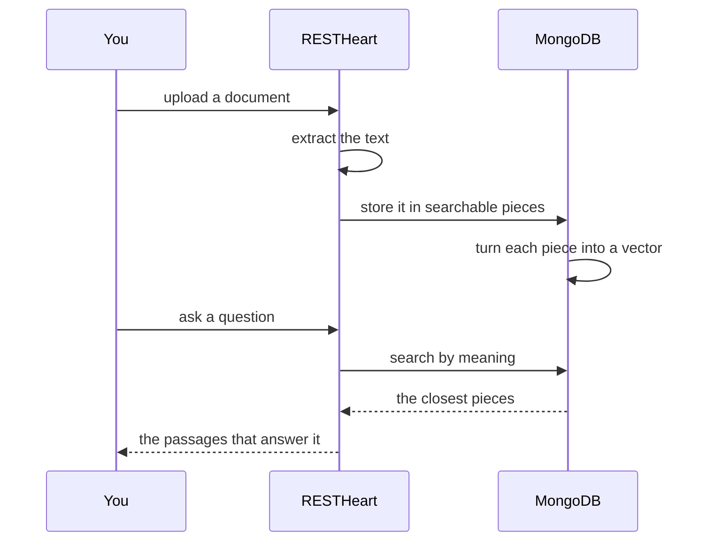

# RESTHeart AI

Make Your MongoDB Backend **AI-Ready**

<div class="abs-br m-6 text-xl opacity-60">
  RESTHeart 9.9
</div>

---
layout: center
class: text-center
---

# The Challenge

AI agents and LLMs need **data** — your data

<div class="grid grid-cols-3 gap-8 mt-12 text-left">
  <div class="p-6 rounded-xl border border-primary/30 bg-primary/5">
    <div class="text-3xl mb-3">🔍</div>
    <h3 class="font-bold mb-2">Semantic Search</h3>
    <p class="text-sm opacity-70">Users expect search that understands meaning, not just keywords</p>
  </div>
  <div class="p-6 rounded-xl border border-primary/30 bg-primary/5">
    <div class="text-3xl mb-3">🤖</div>
    <h3 class="font-bold mb-2">AI Agents</h3>
    <p class="text-sm opacity-70">LLM agents need to query, read, and update your MongoDB data</p>
  </div>
  <div class="p-6 rounded-xl border border-primary/30 bg-primary/5">
    <div class="text-3xl mb-3">📄</div>
    <h3 class="font-bold mb-2">RAG Pipelines</h3>
    <p class="text-sm opacity-70">Retrieval-Augmented Generation requires chunking and indexing your documents</p>
  </div>
</div>

---
layout: center
---

# What RESTHeart AI Delivers

Four capabilities, one optional plugin.
**All of it shipped in RESTHeart 9.9 — open source.**

<div class="grid grid-cols-4 gap-4 mt-8 text-center text-sm">
  <div class="p-4 rounded-xl border border-primary/30 bg-primary/5">
    <div class="text-2xl mb-2">🔐</div>
    <div class="font-bold">OAuth 2.0</div>
    <div class="opacity-60 mt-1">Agents can authenticate</div>
  </div>
  <div class="p-4 rounded-xl border border-primary/30 bg-primary/5">
    <div class="text-2xl mb-2">🔍</div>
    <div class="font-bold">Vector Search</div>
    <div class="opacity-60 mt-1">Search by meaning</div>
  </div>
  <div class="p-4 rounded-xl border border-primary/30 bg-primary/5">
    <div class="text-2xl mb-2">🧩</div>
    <div class="font-bold">AI Providers</div>
    <div class="opacity-60 mt-1">Bring your own model</div>
  </div>
  <div class="p-4 rounded-xl border border-primary/30 bg-primary/5">
    <div class="text-2xl mb-2">🔌</div>
    <div class="font-bold">MCP Server</div>
    <div class="opacity-60 mt-1">Agents can use your API</div>
  </div>
</div>

---
layout: center
class: text-sm max-w-3xl mx-auto
---

# OAuth 2.0
### The prerequisite for everything else

An AI agent cannot use an API it cannot authenticate against. Before MCP, RESTHeart had to speak the standards agents already speak.

It now does: a `/token` endpoint, auto-discovery, and the protected-resource metadata that MCP's own OAuth profile requires.

Any OAuth 2.0 client works, agent or not.

<div class="mt-8 opacity-60 text-sm">
  RFC 6749 · RFC 8414 · RFC 9728 &nbsp;·&nbsp; restheart.org/docs/ai/mcp
</div>

---
layout: center
class: text-sm max-w-3xl mx-auto
---

# Vector Search
### Search that understands meaning

Semantic search over your own data, with no pipeline to build and no second system to run.

- **Indexes** — declare a vector index on any collection
- **Documents** — upload a PDF or a Word file; RESTHeart extracts the text and stores it in searchable pieces
- **Embeddings** — MongoDB generates the vectors, or you bring your own model
- **Reranking** — refine the results before they reach the agent

<div class="mt-8 opacity-60 text-sm">
  restheart.org/docs/ai/vector-search
</div>

---
layout: center
class: text-center
---

# From a PDF to an Answer

Upload a document. Ask a question. Nothing in between is yours to build.


```mermaid {scale: 0.7}
sequenceDiagram
    participant You
    participant RESTHeart
    participant MongoDB

    You->>RESTHeart: upload a document
    RESTHeart->>RESTHeart: extract the text
    RESTHeart->>MongoDB: store it in searchable pieces
    MongoDB->>MongoDB: turn each piece into a vector

    You->>RESTHeart: ask a question
    RESTHeart->>MongoDB: search by meaning
    MongoDB-->>RESTHeart: the closest pieces
    RESTHeart-->>You: the passages that answer it
```

---
layout: center
class: text-sm max-w-3xl mx-auto
---

# Bring Your Own Model
### When MongoDB's own embeddings are not the ones you want

MongoDB can generate the vectors for you. When it cannot — or when you need a particular model — RESTHeart calls the provider itself.

- **Embeddings** — OpenAI, Voyage AI, AWS Bedrock, or Ollama for a model that never leaves your machine
- **Reranking** — Cohere, Voyage AI, AWS Bedrock
- **Wherever you need it** — inside an aggregation, or automatically as documents are written
- **Nothing changes for clients** — the same requests, the same responses

<div class="mt-8 opacity-60 text-sm">
  restheart.org/docs/ai/vector-search
</div>

---
layout: center
class: text-sm max-w-3xl mx-auto
---

# The MCP Server
### Teach the agent your API, don't rebuild it

RESTHeart already exposes a full REST API. The MCP server does not reimplement it — it teaches the agent how to use it.

Three tools are the whole navigation layer: **what exists**, **how to call it**, and **a credential to call it with**. The agent then makes the request itself, straight to the API.

No data passes through the MCP tools, and there is no second API to keep in step with the first. Your existing endpoints stay the only source of truth.

<div class="mt-8 opacity-60 text-sm">
  restheart.org/docs/ai/mcp
</div>

---
layout: center
class: text-sm
---

# Every Collection Is Already There

Nothing to write, nothing to wire.

<div class="grid grid-cols-2 gap-8 mt-8 text-left">
<div class="p-5 rounded-xl border border-primary/30 bg-primary/5">

**What an agent gets**

Your collections, aggregations, change streams and GraphQL apps — discoverable, callable, and readable straight into its context. It can subscribe to a collection and be told when the data changes.

Your permissions decide what it sees. An agent is a caller like any other.

</div>
<div class="p-5 rounded-xl border border-primary/30 bg-primary/5">

**What you write**

For MongoDB and GraphQL: a line of metadata on the collection.

For your own plugin: implement one interface. Every method has a default, so the common case is an annotation and nothing else.

</div>
</div>

<div class="mt-8 text-center opacity-60 text-sm">
  restheart.org/docs/framework/mcp-aware
</div>

---
layout: two-cols
layoutClass: gap-8
class: text-sm
---

# One Deployment, Many Customers

An MCP server that can only serve one customer is a server you have to run once per customer.

RESTHeart runs **one process** and gives every caller a catalogue of its own: an agent discovers its customer's collections, under its customer's own URLs, and nothing else.

**Why it is not just an ACL question**

Permissions decide what a caller may *read*. They do not stop a catalogue from being built out of everybody's data in the first place — and a list of resource names is already information.

So the catalogue itself is partitioned, not merely filtered.

::right::

<div class="p-4 rounded-xl border border-primary/30 bg-primary/5">

**Agent of customer A**
```
list_apis → inventory, orders
             on a.example.com
```

</div>

<div class="p-4 mt-4 rounded-xl border border-primary/30 bg-primary/5">

**Agent of customer B**, same process
```
list_apis → catalog, invoices
             on b.example.com
```

</div>

<div class="mt-6 opacity-70">

Neither can see, name, or read the other's. A single deployment serves both, and neither is aware the other exists.

</div>


---
layout: center
---

# Where This Stands

<div class="text-center opacity-70 mb-10">It was a plan in three phases. All three shipped in 9.9, so this is the starting point, not the destination.</div>

<div class="grid grid-cols-3 gap-6 text-left text-sm">

<div class="p-5 rounded-xl border border-primary/30 bg-primary/5">
  <div class="text-2xl mb-3">🔐</div>
  <h3 class="font-bold mb-2">Agents can get in</h3>
  <p class="opacity-70">Standards-compliant OAuth, including the parts MCP's own profile requires.</p>
</div>

<div class="p-5 rounded-xl border border-primary/30 bg-primary/5">
  <div class="text-2xl mb-3">🔍</div>
  <h3 class="font-bold mb-2">Your data is searchable by meaning</h3>
  <p class="opacity-70">Vector search, document ingestion, embeddings from MongoDB or from a model you choose.</p>
</div>

<div class="p-5 rounded-xl border border-primary/30 bg-primary/5">
  <div class="text-2xl mb-3">🔌</div>
  <h3 class="font-bold mb-2">Agents can use it</h3>
  <p class="opacity-70">An MCP server over your existing API, with a catalogue per customer on a shared deployment.</p>
</div>

</div>

---
layout: center
class: text-center
---

# Summary

RESTHeart 9.9 makes your MongoDB backend **natively AI-ready**

<div class="grid grid-cols-2 gap-6 mt-10 text-left text-sm">

<div class="p-5 rounded-xl border border-primary/30 bg-primary/5">
  <h3 class="font-bold mb-3 text-base">For your data</h3>
  <ul class="space-y-2 opacity-80">
    <li>✓ Search by meaning, on any collection</li>
    <li>✓ Upload a PDF and have it become searchable</li>
    <li>✓ No pipeline to build, no second system to run</li>
    <li>✓ Or bring the model you already trust</li>
  </ul>
</div>

<div class="p-5 rounded-xl border border-primary/30 bg-primary/5">
  <h3 class="font-bold mb-3 text-base">For your agents</h3>
  <ul class="space-y-2 opacity-80">
    <li>✓ Works with Claude, Cursor, VS Code, any MCP client</li>
    <li>✓ Your collections, discoverable and readable as they are</li>
    <li>✓ Your permissions decide what an agent sees</li>
    <li>✓ One deployment, a catalogue per customer</li>
  </ul>
</div>

</div>

<div class="mt-10 opacity-60 text-sm">
  github.com/SoftInstigate/restheart · restheart.org/docs/ai/mcp
</div>
