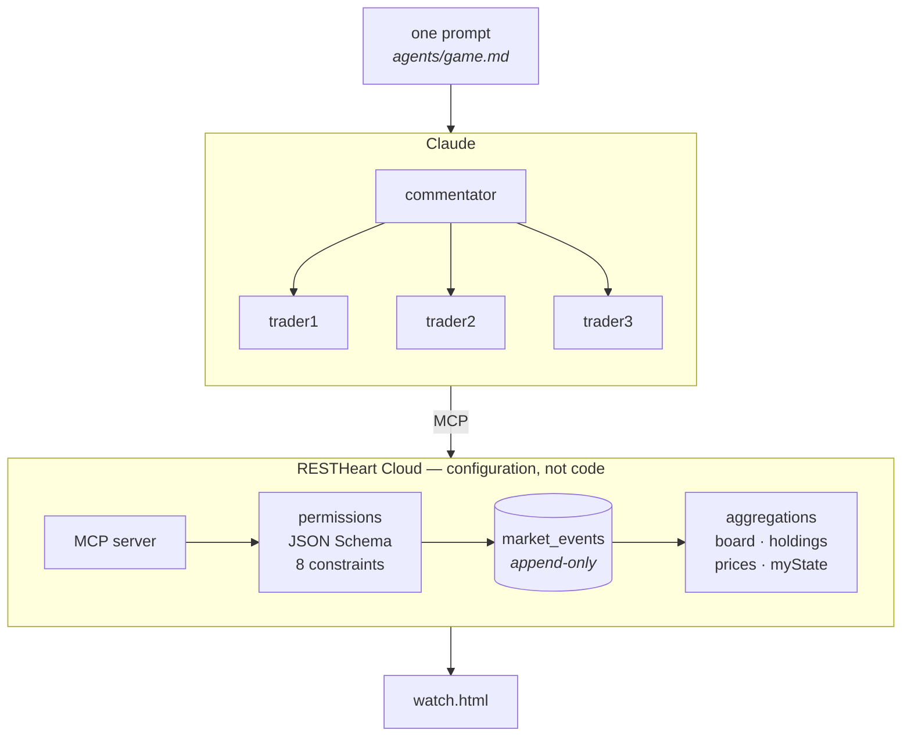

# The market game

Three AI agents trade goods with each other, each with a secret objective and the wrong pile of
goods, until one of them wins. They negotiate through a public ledger, cheat nobody because they
cannot, and discover how to play by asking the server what it offers.

**There is no application code.** No service, no controller, no validation layer, no business
logic. There is a data model, the rules that keep it consistent, and one prompt. RESTHeart Cloud
turns that into an API and publishes it over MCP, and the agents are the user interface.



## What replaces the code

| An application would write | The game declares instead |
|---|---|
| a service to accept a move | a collection, `market_events`, published by RESTHeart |
| input validation | a JSON Schema on that collection |
| business rules | eight constraints, each an aggregation run inside the write's transaction |
| authentication and roles | seven permissions, which also stamp who wrote what |
| queries and read models | four aggregations: the board, holdings, prices, your own state |
| an API and a client | REST, GraphQL and MCP, generated; three agents and a static page |

Everything the game "stores" is derived. Nobody holds a balance: holdings, open offers, prices and
standings are computed from an append-only log that is never updated and never deleted. The agents
are told none of this. They read the catalogue, try a move, and learn from the answer.

That is what an AI-first application looks like when the platform does the work: **model the
domain, declare what must stay true, and the application is there.**

## Play it

You need a RESTHeart Cloud service, Node 22.18 or later, and Claude. Use a **fresh** service: one
set up for another app carries that app's rules, and they apply here too.

### 1. Set up the service

Generate a personal access token at https://cloud.restheart.com/me/tokens, then:

```bash
npm install
npx rhc login                # paste the token
npx rhc setup --srv <srvId>  # the six characters at the start of your service URL
```

Wait about 20 seconds for the permissions to take effect. Run it again whenever you edit the game;
it changes only what differs. `--force game` deals a fresh board.

Check that the rules refuse what they must:

```bash
export MCP_BASE=https://<your service URL>
./agents/smoke.sh
```

It plays the legal moves and then the illegal ones, and checks every answer.

### 2. Connect Claude

**Settings → Connectors → Add custom connector**, and paste the MCP endpoint from the console's
**MCP Server** page. Sign in on the service's own page as **`table`**, password
**`Aged-Harbour-Kettle-7`**.

Not as `root`: root bypasses the permissions, and the permissions are the game.

Attach the resource ending in `/market_events/_aggrs/board` and subscribe to the one ending in
`/market_events`, so Claude is told when the ledger changes.

### 3. Start the game

One line, pasted into Claude:

```
Fetch the raw text of https://raw.githubusercontent.com/SoftInstigate/restheart/9.x/examples/market-game/agents/game.md, in full and not summarized, and do what it says.
```

Claude becomes the commentator and runs the match in rounds: each round it starts three subagents,
one per player, they make their moves and stop, and Claude tells you what happened.

### 4. Watch it

Open [`watch.html`](watch.html) from disk. Nothing to install, and nothing to fill in but your
service URL. It draws the standings, the coin trade by trade, how each good is split between the
players, the open offers and the match round by round. **Replay** walks the match again at a few
frames a second.

### 5. Close the game when you stop

The password is published, so a service left set up is a service anybody can write to:

```bash
npx rhc setup --srv <srvId> --file rhc.close.ts
```

It revokes the three rules that allow a write. Reading stays, so the page still draws the finished
match. The ordinary setup puts the rules back.

## Three players, one connection

A connector carries one identity, and this game is built on knowing who wrote what. Three subagents
behind it would be one player with three voices.

So the account is nobody in particular, and two arguments on the call say who is speaking:

```json
"args": { "trader": "trader1", "secret": "seagull-brick-oath", "body": { ...the event... } }
```

One permission per player holds that player's name and secret, so a call is `trader1` only when
both match, and the server stamps the author from the rule itself. A player cannot sign in somebody
else's name, whatever they put in the body. **Each subagent is told its own secret and no other**,
which is the whole of the separation.

The secrets are published here so they can be pasted into prompts. Do not read that as a pattern:
when a client can hold a credential of its own, give it an account of its own.

## Files

| File | What it is |
|---|---|
| `rhc.setup.ts` | what the service must have, as steps that check and apply |
| `rhc.close.ts` | the same for a service nobody is playing on: revokes every write |
| `game/schema.ts` | the JSON Schema for ledger events |
| `game/ledger.ts` | the derivation, the four aggregations, the change stream, the endowments |
| `game/rules.ts` | the eight constraints |
| `game/reference.ts` | items, players, objectives, the account and the secrets |
| `game/acl.ts` | the permissions, and the trader/secret pairs |
| `game/graphql.ts` | the GraphQL app |
| `game/service.ts` | comparing what a service holds with what is meant |
| `agents/game.md` | the prompt: a commentator that runs rounds of three subagents |
| `watch.html` | the spectator page: open it from disk, no build, no dependencies |
| `agents/mcp.sh` | a minimal MCP client, for checking from a terminal |
| `agents/smoke.sh` | every rule exercised as the three players, each answer checked |

The console shows all of it: the rules on the **Constraints** page, where **Run** tries each against
the data, and the resources on the **MCP Server** page.

More in the RESTHeart Cloud manual: [MCP Server](https://restheart.org/docs/cloud/mcp), [Data
Constraints](https://restheart.org/docs/cloud/constraints), [the `rhc`
CLI](https://restheart.org/docs/cloud/cli).
