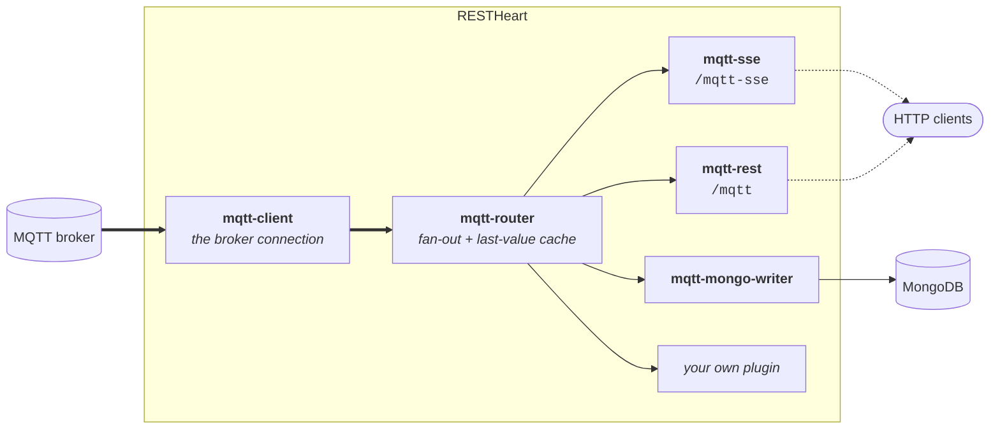
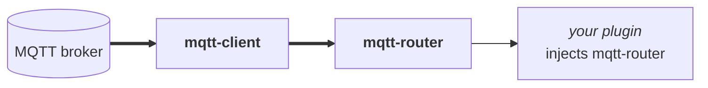
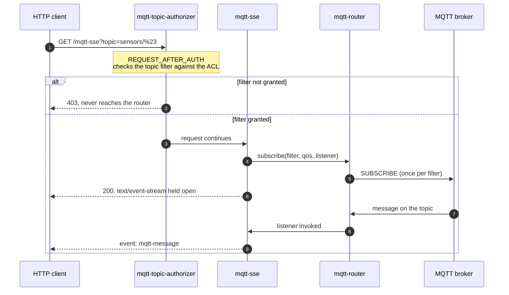
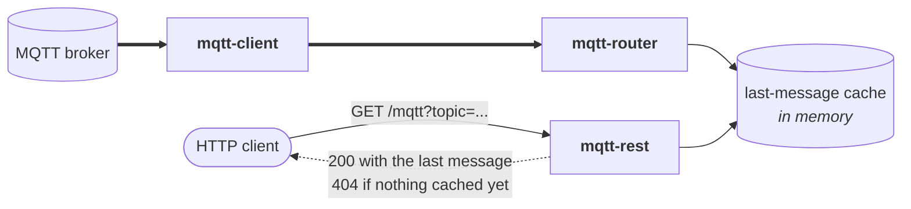
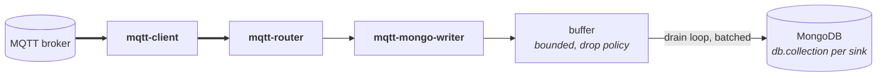

# restheart-mqtt

Bridges an external MQTT broker into RESTHeart: incoming topic messages become Server-Sent Events, REST responses, MongoDB documents, or input to your own plugins.

The module connects to any MQTT 3.1.1 or 5.0 broker (Mosquitto, HiveMQ, EMQX) using [hivemq-mqtt-client](https://github.com/hivemq/hivemq-mqtt-client) 1.4.0, and exposes what it receives through ordinary RESTHeart plugins. Brokers that require mutual TLS with a client certificate — AWS IoT Core among them — are not supported: the module exposes only trust-store settings (`tls`, `tls-trust-store`, `tls-trust-store-password`), never a key store or client certificate.

> **New here? Start with [TUTORIALS.md](./TUTORIALS.md).** It is one progressive walkthrough in four
> parts — stream a message to a browser, poll the last value, persist to MongoDB while deliberately
> stopping the database, and consume messages from your own plugin — each part building on the
> environment the previous one left running. This README is the reference; that is the way in.

## Not bundled

`restheart-mqtt` does not ship with RESTHeart: it is not in the distribution zip and not in the Docker image. It is installed separately — see "Installing" below. This is deliberate. MQTT is far from RESTHeart's habitual use cases, and `hivemq-mqtt-client` brings 13 transitive jars including RxJava and seven Netty modules, a second network stack and reactive runtime that exists nowhere else in a product built on Undertow/XNIO. Bundling it would add all of that to every RESTHeart installation, including the ones that never touch MQTT.

The module still lives in the RESTHeart monorepo, and its integration tests run against the core built alongside it — see "Building".

## What you get

| Plugin | Kind | Default URI | Enabled by default |
|---|---|---|---|
| `mqtt-client` | `Provider<MqttClient>` | — | No (Tier 1, the module switch) |
| `mqtt-router` | `Provider<MqttMessageRouter>` | — | No (gated explicitly, see below) |
| `mqtt-connector` | `Initializer` (`AFTER_STARTUP`) | — | Yes (connects the client, last of all) |
| `mqtt-sse` | `SseService` | `/mqtt-sse` | No (Tier 2) |
| `mqtt-rest` | `JsonService` | `/mqtt` | No (Tier 2) |
| `mqtt-topic-authorizer` | `WildcardInterceptor` | — | Yes (deliberately, fails closed) |
| `mqtt-mongo-writer` | `Initializer` (`AFTER_STARTUP`) | — | No (Tier 2) |
| `mqtt-metrics-collector` | `Initializer` (`AFTER_STARTUP`) | — | Yes (registers the router's gauges) |
| `mqtt-stats` | `JsonService` | `/mqtt/stats` | No (Tier 2) |
| `mqtt-status` | `Initializer` (`AFTER_STARTUP`) | — | Yes (diagnostic sentinel) |

How the pieces fit together:



`mqtt-sse` and `mqtt-rest` are both registered with `secure = true`: they require authentication. See "Enablement" below for what the "Enabled by default" column means in practice.

## Enablement

The module is dormant on installation, in two tiers.

**Tier 1 (the module switch).** `mqtt-client` is registered with `enabledByDefault = false`. Nothing else in the module can do anything until it is armed:

```yaml
mqtt-client:
  enabled: true
  broker-url: "tcp://broker:1883"
```

`mqtt-router` is registered with `enabledByDefault = false` too, and is enabled together with `mqtt-client`. It does not rely on `ProvidersChecker` following the injection graph: a disabled provider is never instantiated, so with `mqtt-client` off, `mqtt-client` is absent from the provider registry entirely and an enabled `mqtt-router` would log a "no provider found" ERROR on every startup. Enabling `mqtt-client` without `mqtt-router` leaves the module with no message routing, so enable both.

**Tier 2 (opt-in surfaces).** Arming Tier 1 alone exposes no HTTP endpoint. `mqtt-sse`, `mqtt-rest` and `mqtt-mongo-writer` are each independently registered with `enabledByDefault = false`, and are switched on one at a time as needed:

```yaml
mqtt-sse:
  enabled: true

mqtt-rest:
  enabled: true

mqtt-mongo-writer:
  enabled: true
```

**`mqtt-topic-authorizer` stays enabled by default**, regardless of the two tiers above, deliberately, not as an oversight. While every Tier 2 endpoint is off, the authorizer is simply never invoked and costs nothing. The moment one is turned on, the authorizer is already active and fails closed with no ACL configured, so a Tier 2 endpoint can never be reachable without topic authorization already in force, not even for a moment, and not even because an operator forgot a flag.

### Four realistic configurations

**Provider only.** Inject `mqtt-router` from your own plugin, as [`examples/mqtt-logger`](../examples/mqtt-logger) does, with no HTTP endpoint exposed at all:



```yaml
mqtt-client:
  enabled: true
  broker-url: "tcp://broker:1883"

mqtt-router:
  enabled: true
```

**Live SSE:**



```yaml
mqtt-client:
  enabled: true
  broker-url: "tcp://broker:1883"

mqtt-router:
  enabled: true

mqtt-sse:
  enabled: true
  default-topic: "sensors/#"

mqtt-topic-authorizer:
  acl:
    iot-reader:
      - "sensors/#"
```

**REST polling.** `mqtt-rest` only ever answers from the router's last-message cache, so something has to prime it:



```yaml
mqtt-client:
  enabled: true
  broker-url: "tcp://broker:1883"

mqtt-router:
  enabled: true
  last-message-cache: true
  subscriptions:
    - topic: "sensors/#"
      qos: 1

mqtt-rest:
  enabled: true

mqtt-topic-authorizer:
  acl:
    iot-reader:
      - "sensors/#"
```

**MongoDB persistence:**



```yaml
mqtt-client:
  enabled: true
  broker-url: "tcp://broker:1883"

mqtt-router:
  enabled: true

mqtt-mongo-writer:
  enabled: true
  mongo-sink:
    - topic: "sensors/#"
      database: "iot"
      collection: "sensor-events"
```

This last one also needs the `mongoclient` module configured and connected: `mqtt-mongo-writer` injects `mclient` rather than opening its own connection.

## Installing

The module is distributed as an archive containing the plugin, its runtime dependencies, a sample configuration and both licences. Download the latest build from `master` and unpack it into your instance's plugins directory:

```
curl -LO https://github.com/SoftInstigate/restheart/releases/download/mqtt-snapshot/restheart-mqtt-10.0.0-SNAPSHOT.zip
unzip restheart-mqtt-10.0.0-SNAPSHOT.zip -d /opt/restheart/plugins/
```

That archive is published by [`.github/workflows/mqtt.yml`](../.github/workflows/mqtt.yml) on every push to `master`, and **only after this module's integration tests have passed** against the core built alongside it. The release notes record which commit each build came from.

To build it yourself instead — necessarily, if you are working on the module:

```
./mvnw -pl mqtt package
unzip mqtt/target/restheart-mqtt-<version>.zip -d /opt/restheart/plugins/
```

Either way you get:

```
plugins/restheart-mqtt-<version>/
├── restheart-mqtt.jar
├── lib/                              hivemq-mqtt-client and its 13 transitives
├── restheart-mqtt-default-config.yml
├── LICENSE.txt
└── COMM-LICENSE.txt
```

The version directory is deliberate, not an accident of packaging. `PluginsScanner` scans the plugins directory two levels deep and treats any `lib` path segment as classpath-only, never scanning it for plugins, so both the jar and its dependencies are picked up from there. Keeping `lib/` inside the module's own directory rather than merging it into the shared `plugins/lib` is what stops this module's Netty and RxJava from mixing with other plugins' dependencies — see [#724](https://github.com/SoftInstigate/restheart/issues/724).

Then copy the settings you need from `restheart-mqtt-default-config.yml` into your instance's configuration, and enable at least `mqtt-client` and `mqtt-router`. See "Enablement" above for what each plugin's switch does.

**The RESTHeart you install into must be recent enough** to run the SSE handshake through `WildcardInterceptor`s (`SseWildcardInterceptorsExecutor`). Without that, `mqtt-topic-authorizer` resolves but is never invoked on the `/mqtt-sse` path, leaving the endpoint authenticated but not authorized per topic — a topic outside the ACL is silently accepted instead of rejected with `403`. See "Operational notes".

## Durability

A message is acknowledged to the broker only once a durable consumer has taken responsibility for it. With `mqtt-mongo-writer`, that means after the write to MongoDB succeeds or the batch is dead-lettered. Until then the broker still owes it, and will redeliver if this instance dies. So with QoS 1 and a persistent session, the module delivers at-least-once end to end.

This is a change from the original design, where the client acknowledged every message the instant it was handed over, before anything decided whether to keep it. The broker's redelivery guarantee was discarded before the message reached storage, so the module was at-most-once whatever QoS was configured. The difference matters, and it cuts both ways: at-most-once loses messages, at-least-once duplicates them. A redelivered message is delivered again, so the same reading can be written twice — after a crash, and on any reconnect that resumes a session mid-flight. That is the trade you are making, and `id-strategy` is how you settle it: `payload-field` keys the document on something the message itself carries, so a redelivery converges on one document instead of adding a second. Leaving `id-strategy` at `auto` means every redelivery is a new document.

Three things are required:

- **QoS 1 or 2.** QoS 0 has no acknowledgement in the protocol at all, so there is nothing to withhold and nothing to redeliver. The guarantee does not exist at QoS 0.
- **`clean-session: false`** (the default), so the broker keeps the session and redelivers what the last connection owed when the next one resumes.
- **A stable `client-id`.** An MQTT session is keyed on it. The default is now derived from the RESTHeart instance name (`restheart-<instance name>`) rather than a fresh UUID per start, which is what makes it stable. **A client id must be unique across concurrently connected clients:** a broker disconnects the existing client when another connects with the same id. So several RESTHeart instances sharing one `/core/name` will knock each other off the broker in a loop. Give each instance its own name, or set `/mqtt-client/client-id` explicitly.

Why connecting is a separate step: a broker redelivers everything a resumed session owes the moment it sends CONNACK. Anything not listening at that instant loses those messages. The module registers consumers at three different moments — `mqtt-client` builds the client, `mqtt-router` registers the global publish consumer, `mqtt-mongo-writer` registers its durable listener at AFTER_STARTUP — so `mqtt-connector` exists purely to connect after all of them. It is enabled by default so nobody has to remember it; disabling it leaves a module that never reaches the broker, and `mqtt-status` reports that.

What the guarantee does not cover: SSE and REST are live consumers and never hold up an acknowledgement — a browser must not be able to stall ingestion. The guarantee is about the persistence path, not about what a dashboard sees.

**It covers a fast restart, not an outage.** `mqtt-mongo-writer`'s buffer waits up to `buffer.max-wait-ms` (30 s by default) for room before giving up on a message; past that it drops it, counts it in `mqtt_buffer_dropped`, and acknowledges it so the broker can move on. That ceiling is the honest boundary of what this layer can do: it absorbs a MongoDB restart of seconds to tens of seconds, which is what a buffer in memory is good for. **A prolonged database outage is not something an application can bridge, and this one does not pretend to** — the defence against that is a properly sized replica set, not a longer queue.

The ceiling exists for a second reason, and it is the one that matters most in practice: **without it a MongoDB problem would take the live stream down with it.** An unbounded wait parks the dispatching thread, and that thread is holding a message that is therefore never acknowledged; once enough of them accumulate the broker's in-flight window fills and it stops delivering to this client altogether — SSE included, even though SSE never touches the database. Bounding the wait keeps the two independent, so consumers go on reading messages while persistence is degraded. Set `buffer.max-wait-ms` to `0` to wait indefinitely instead, accepting that coupling.

## The traps

Most of these are silent: nothing refuses to start, and nothing complains unless you go looking. One of them is not, and is called out below.

- **A config block present without `enabled: true` leaves the plugin off.** The block looks complete and correct; it just isn't read, because `PluginRecord.isEnabled` falls back to the plugin's compiled default (`false` for every Tier 1/2 plugin) whenever the `enabled` key is absent.
- **Plugin config blocks are top-level keys named after the plugin.** There is no `plugins-args:` wrapper: `PluginsFactory` looks up each plugin's arguments by name directly at the root of the configuration map. That wrapper form is not handled at all, so every setting nested under it is ignored and the plugin runs entirely on defaults. This is the one trap here that announces itself: core logs a WARN at startup naming every plugin whose block a `plugins-args` wrapper swallowed ([#723](https://github.com/SoftInstigate/restheart/issues/723)).
- **`mqtt-rest` answers `404` forever** unless something populates the router's last-message cache (`mqtt-router.subscriptions`, a live SSE client, or the writer's `mongo-sink`) **and** `mqtt-router.last-message-cache` is `true`.
- **After a restart, `mqtt-rest` answers `404` again until the next message arrives** — the cache is in memory and does not survive the process. There is a broker-side remedy that costs nothing: if publishers publish the latest state **retained**, the broker replays it on the SUBSCRIBE this module issues at every startup, and the cache is correct immediately. Measured: with a retained value, `GET /mqtt` answers `200` straight after a restart with nothing republished; without one, `404`. This does not replace `mqtt-router.subscriptions` — with no subscription there is no SUBSCRIBE and nothing is replayed — but it removes the blind window after every restart, which on a slow topic can last a long time.
- **`mqtt-mongo-writer` with an empty `mongo-sink` runs and writes nothing.** With no sinks, the writer never subscribes to anything on the router at all, so nothing is ever offered to the buffer and it stays empty — not a buffer that fills and drains into nowhere.
- **`mqtt-topic-authorizer` with no `acl` denies everything with `403`.** There is no permissive default.
- **A request with no `?topic=` is not unauthenticated territory.** `mqtt-sse` subscribes such a request to its `default-topic` (`sensors/#` by default), so the ACL must grant that filter or the request is refused with `403`. Granting only specific topics while leaving `default-topic` at its default is the common mistake.
- **MQTT 5 settings under `protocol-version: 3` are dropped.** `session-expiry-seconds`, `will.delay-seconds` and `will.message-expiry-seconds` exist only in MQTT 5.0, and the 3.1.1 connection path has nowhere to put them — the values are read and validated, then discarded. A will message configured with a delay fires immediately instead.

`mqtt-status` reports five of these at startup, by comparing the configuration against what the plugin registry actually instantiated: the missing `enabled` key, MQTT 5 keys under `protocol-version: 3`, `mqtt-rest` with an unprimed cache, an empty `mongo-sink`, and an empty `acl`. The `plugins-args` wrapper is reported by core instead. The `default-topic` one is reported by neither — it is a working ACL doing exactly what it was told, so there is nothing for a sentinel to find. Check the log before assuming a misconfiguration is a bug.

## Quick start

```yaml
mqtt-client:
  enabled: true
  broker-url: "tcp://localhost:1883"
  protocol-version: 5

mqtt-router:
  enabled: true
  subscriptions:
    - topic: "sensors/#"
      qos: 1

mqtt-sse:
  enabled: true
  default-topic: "sensors/#"

mqtt-rest:
  enabled: true

mqtt-topic-authorizer:
  acl:
    admin:
      - "sensors/#"
```

Then:

```
curl -N -u admin:secret 'http://localhost:8080/mqtt-sse?topic=sensors/temp'
curl -u admin:secret 'http://localhost:8080/mqtt?topic=sensors/temp'
```

## Try it in two minutes

[`mqtt/docker-compose.yml`](./docker-compose.yml) runs a self-contained two-container demo (RESTHeart plus a Mosquitto broker, no MongoDB) with the module already armed and a working ACL, so there is no broker or config to set up by hand. It bind-mounts `mqtt/target` into the RESTHeart container's plugins directory, so build the module first. From the `mqtt` directory:

```
../mvnw -f ../pom.xml -pl mqtt package
docker compose up
```

Then, in another shell:

```
curl -N -u admin:secret 'http://localhost:8080/mqtt-sse?topic=sensors/temp'
```

And in a third shell, publish a message:

```
docker compose exec mosquitto mosquitto_pub -t sensors/temp -m '{"value": 21.5}'
```

It runs `softinstigate/restheart-snapshot:latest` rather than a released image, because per-topic ACL enforcement on `/mqtt-sse` needs a fix that is currently only on unreleased `master`; against a released image the same demo would silently accept a topic outside the ACL instead of rejecting it with `403`.

This demo is for trying the module out, not for testing it. To exercise a locally modified module properly, run its integration tests: `./mvnw -pl mqtt -am verify -Pmqtt-it` — those launch the core you just built, rather than a published image. See "Building".

## Configuration

See "Enablement" above for each plugin's `enabled` default; the tables below cover the other keys only.

### `mqtt-client`

| key | default | notes |
|---|---|---|
| `broker-url` | `tcp://localhost:1883` | `tcp`, `ssl`, `mqtts`, `ws`, `wss` |
| `protocol-version` | `3` | `3` or `5` only; anything else fails at startup |
| `client-id` | generated | `restheart-<instance name>` when absent or blank; must be unique per concurrently connected instance |
| `username`, `password` | none | |
| `clean-session` | `false` | persistent session, so the broker replays what you missed. With the documented defaults the session is now stable across restarts — see "Durability" above. |
| `keep-alive-seconds` | `60` | `< 0` fails at startup |
| `connect-timeout-seconds` | `10` | must be > 0 |
| `session-expiry-seconds` | `4294967295` | MQTT 5 only |
| `tls` | `false` | forces TLS even on a plaintext scheme |
| `tls-trust-store`, `tls-trust-store-password` | none | |
| `reconnect.enabled` | `true` | |
| `reconnect.initial-delay-ms` | `1000` | exponential back-off from here |
| `reconnect.max-delay-ms` | `30000` | |
| `will.topic`, `will.payload` | none | |
| `will.qos` | `0` | must be 0-2 |
| `will.retain` | `false` | |
| `will.delay-seconds` | `0` | MQTT 5 only |
| `will.message-expiry-seconds` | none | MQTT 5 only |

The port follows the scheme when you do not give one: 1883 for `tcp`, 8883 for `ssl`/`mqtts`, 80 for `ws`, 443 for `wss`. Setting `tls: true` on a plaintext scheme also moves the default port (`tcp://broker` becomes port 8883, not 1883); an explicit port always wins.

`protocol-version` is a construction-time choice — `Mqtt3Client` and `Mqtt5Client` are separate class hierarchies — so changing it requires a restart.

### `mqtt-router`

| key | default | notes |
|---|---|---|
| `max-inflight-messages-per-second` | `5000` | global token bucket; excess messages are dropped, not queued. `0` or any value `<= 0` disables the rate limit entirely. |
| `last-message-cache` | `true` | backs `mqtt-rest` and the SSE replay-on-connect |
| `last-message-cache-size` | `1000` | LRU |
| `subscriptions` | `[]` | list of `{topic, qos}` subscribed at startup |

Subscriptions declared here survive a broker session reset: when the client reconnects with a new session, the router re-subscribes them.

`qos` is optional and defaults to `0`. It accepts an integer or a numeric string — `qos: "1"` works, since quoting a number in YAML is easy to do by accident — but any other value, including an out-of-range one such as `5`, fails at startup naming the offending entry rather than quietly becoming `0`. An entry whose `topic` is missing or blank is skipped with a warning; the other entries are still subscribed.

### `mqtt-sse`

| key | default | notes |
|---|---|---|
| `default-topic` | `sensors/#` | used when the request omits `?topic=` |
| `default-qos` | `1` | |
| `per-connection-queue-capacity` | `256` | full queue drops the newest message for that client only |
| `payload-envelope` | `false` | `true` wraps the payload as `{topic, payload, receivedAt, qos, replay, retain}` |
| `last-message-cache` | `true` | on connect, replays the cached last message of **every** topic currently cached that matches the request's topic filter, sorted by `receivedAt` — not just one message |
| `max-connections-per-topic` | `0` | `0` = unlimited |
| `keep-alive-ms` | `20000` | period of the SSE keep-alive comment; `0` disables it |
| `pipeline` | none | see below |

**`replay` and `retain` are two different questions, and a consumer that wants live data must ask both.** They only exist with `payload-envelope: true`; the raw format has nowhere to put them.

- `replay` — this delivery came from the router's last-message cache rather than from the live stream. It is a fact about *this* delivery, so two clients can legitimately disagree about the same message.
- `retain` — the broker delivered this as the topic's last known state because the subscription was new. It is a fact about the *delivery from the broker*, so every consumer inside this instance agrees about it.

  **It is not the publisher's retain flag.** MQTT 3.1.1 §3.3.1.3 has the server set RETAIN on delivery only when the message is sent as the result of a *new subscription*, and clear it for an established subscription however the publisher set it. So `retain: true` means "I was given this because I had just subscribed", not "the publisher asked for this to be retained" — which a subscriber cannot know. Measured both ways with `mosquitto_sub -F '%r'`: the same retained publish arrives with the flag set to a fresh subscription and clear to an established one.

They are orthogonal, and the combination that catches people is `replay: false, retain: true`: the first client to subscribe to a filter receives the broker's retained value through the live path, so it arrives looking like an event that has just happened. **A genuinely new event is neither replayed nor retained.**

`retain` also carries a warning about the timestamp next to it: `receivedAt` is always assigned locally when the message arrives, so a retained value published days ago is stamped with the moment this instance received it. MQTT 3.1.1 transports no publisher timestamp, so a retained message's true age cannot be recovered — `retain: true` tells you not to trust `receivedAt` as the time of measurement, not how wrong it is.

**`keep-alive-ms` is how a departed client is noticed at all.** Nothing reads an SSE connection after the handshake, so the only way the server learns a client is gone is a write to its socket failing. On a busy topic that happens on the next message; on a quiet one it may never be attempted. Until it is, the connection's router listener stays registered, filling a queue nobody drains, and its broker subscription stays in place — so every message matching both that filter and a broader one is delivered to the module twice, duplicating SSE events for other clients, duplicating custom-plugin callbacks, and duplicating MongoDB documents under `id-strategy: auto`. With `clean-session: false` the leaked broker subscription outlives the process, because it lives in the broker's session. The periodic comment turns that into a bounded wait. Detection takes up to **two** periods, not one: the first write into a half-closed socket succeeds, and only the next one fails.

Query parameters: `?topic=<filter>&qos=<0-2>`. A `qos` that is unparseable or outside 0-2 falls back to `default-qos` with a warning rather than refusing the connection — by the time the service sees the request the SSE handshake has already been sent, so there is no status code left to return. `default-qos` itself is validated at startup, since it is that fallback.

Every event is sent with SSE event type `mqtt-message` — this is the field a client dispatches on (`event: mqtt-message`).

Each event carries an id of the form `<topic>-<epochMillis>-<n>`, where `n` is a per-connection sequence. **These ids are unique within one stream but are not globally meaningful and cannot be used to resume** — `Last-Event-ID` is currently ignored. Resumable replay is tracked in [#606](https://github.com/SoftInstigate/restheart/issues/606).

### Processing pipeline

Events can pass through an ordered chain of stages before reaching the client. Pipelines are declared per topic filter and **instantiated per connection**, so stages holding state (`throttle`, the window aggregators) never share it between clients.

```yaml
mqtt-sse:
  pipeline:
    - topic: "sensors/#"
      stages:
        - type: filter
          jsonpath: "$.temperature"
          condition: "> 30"
        - type: throttle
          max-events-per-second: 10
        - type: tumbling-window
          window-ms: 5000
          function: avg
          field: "$.value"
```

| stage | parameters |
|---|---|
| `filter` | `jsonpath` + `condition`, or `topic-regex`, or `min-qos` |
| `map` | `extract-field` |
| `throttle` | `max-events-per-second` (default `10`) |
| `tumbling-window` | `window-ms` (default `1000`), `function` (default `count`), `field` |
| `sliding-window` | `window-size` (default `10`), `function` (default `count`), `field` |

A window's `field`, `map`'s `extract-field`, and `filter`'s `jsonpath` are **JSONPath expressions** evaluated against the message payload (e.g. `"$.value"`), not plain field names — `"temperature"` is not valid JSONPath and throws for every message, logged at WARN, so the window silently emits nothing. A `map` stage configured without `extract-field` is not rejected: it is silently dropped from the pipeline.

Aggregation functions: `count`, `sum`, `avg`, `min`, `max`, `array`, `last`. A window whose messages yield no numeric values (`avg`/`sum`/`min`/`max`) emits nothing rather than a zero or a sentinel. Tumbling windows are flushed by the connection's drain loop even when no further message arrives, so the last window of a quiet stream is still emitted.

Pipeline selection for a connection is: exact topic-filter match, then MQTT wildcard match, then no pipeline. Every entry must carry a `topic`; one without it could never be selected, so it fails at startup rather than sitting there doing nothing. Every other validation — `window-ms <= 0`, `window-size <= 0`, `max-events-per-second <= 0`, and `avg`/`min`/`max`/`sum` configured with no `field` — is checked only **per connection**, inside the SSE handshake, since pipelines are instantiated fresh for every connection: a bad value throws for that one connection rather than failing at startup.

### `mqtt-rest`

`GET /mqtt?topic=<topic>` returns the last message cached for that topic:

```json
{"topic": "sensors/temp", "payload": "{\"temp\":25}", "receivedAt": "...", "qos": 1}
```

`400` when the `topic` parameter is missing, `404` when nothing is cached for that topic — both with an `{"error": "..."}` body naming the reason. `OPTIONS` is handled for CORS; any other method returns `405`.

Requires `last-message-cache: true` on `mqtt-router`; with the cache disabled every topic returns `404`.

### `mqtt-topic-authorizer`

Restricts which topic filters a role may subscribe to, on both `/mqtt-sse` and `/mqtt`.

```yaml
mqtt-topic-authorizer:
  acl:
    iot-reader:
      - "sensors/#"
      - "devices/+/status"
    admin:
      - "#"
```

An unauthenticated request is denied with `401`. A request whose topic filter is not covered by any of the account's roles is denied with `403`.

**The ACL check is filter containment, not topic matching, and the difference matters.** A pattern grants a requested filter only when everything the requested filter could match is also matched by the pattern. So `sensors/+` does **not** grant `sensors/#`: `#` reaches deeper levels that `+` cannot. Granting `sensors/+` and receiving `sensors/a/b` would be a privilege escalation, so it is refused. `#` in a pattern grants everything below it, as expected.

### `mqtt-mongo-writer`

Persists messages to MongoDB through a bounded in-memory buffer that absorbs traffic peaks.

```yaml
mqtt-mongo-writer:
  buffer:
    strategy: "blocking-queue"
    capacity: 10000
  drain:
    batch-size: 200
    flush-interval-ms: 500
    max-retries: 3
    retry-delay-ms: 1000
    shutdown-timeout-ms: 5000
  id-strategy: "topic-timestamp-hash"
  dead-letter-file: "./mqtt-dead-letter.log"
  dead-letter-max-bytes: 104857600
  mongo-sink:
    - topic: "sensors/#"
      database: "iot"
      collection: "sensor-events"
```

Requires the `mongoclient` module: it injects `mclient` rather than opening its own connection.

**Buffer strategies** (`buffer.strategy`, default `blocking-queue`; `buffer.max-wait-ms` bounds how long `blocking-queue` waits, 30 s by default, `0` for no bound):

| value | on overflow |
|---|---|
| `ring-buffer` | drop the oldest message; the new one is always accepted |
| `drop-incoming` | reject the new message |
| `blocking-queue` | block the producer until space frees up — the only strategy that applies real backpressure rather than losing data |

An unrecognised value fails at startup rather than silently falling back.

**Id strategies** (`id-strategy`, default `auto`):

| value | `_id` | write |
|---|---|---|
| `auto` | ObjectId | `insertMany` |
| `payload-field` | the `id-field` of the payload | upserting `bulkWrite` |
| `topic-timestamp-hash` | hash of topic + timestamp | upserting `bulkWrite` |

Every document also records `retain`, the flag the broker delivered the message with, so the collection records the event rather than an interpretation of it. Without it, a value delivered as a topic's stored last-known-state — possibly days old, and possibly already in the collection from before — is indistinguishable from a measurement just taken. In a steady-state deployment it is `false` on nearly every document, and `true` mainly on the messages delivered just after a (re)start, which is exactly when a row is most likely to be a re-record of an old value.

What it does **not** record, because MQTT does not tell a subscriber, is whether the *publisher* asked for retention (see `mqtt-sse`'s `retain` above). A collection intended as a source for replaying a stream can reproduce topic, payload, QoS and ordering, but not that one publish option.

The two deduplicating strategies write with upserts, so redelivery converges on one document instead of raising duplicate-key errors. Duplicate-key (11000) is counted as a success. `id-field` (default `messageId`) must be set and non-blank when `id-strategy` is `payload-field`; both keys are validated at startup, because a typo would otherwise disable deduplication silently.

With `payload-field`, if the payload is not valid JSON or the field is absent, the failure is swallowed: no `_id` is computed, and that one document falls back to a plain insert instead of an upsert — deduplication is lost silently, per message, rather than failing the write.

**Only `payload-field` converges across a cluster.** `topic-timestamp-hash` deduplicates redelivery within a single node, but not across nodes: its timestamp component is `receivedAt`, set independently by each node's own `Instant.now()` when the message arrives, so two nodes receiving the same broker message compute two different `_id`s and both write a document. Use `payload-field` — keyed on something the broker message itself carries — when several RESTHeart nodes receive the same messages and must converge on one document.

Every `mongo-sink` entry must carry all three of `topic`, `database` and `collection`, each a string; a missing or mistyped key fails at startup naming the entry. An absent or empty `mongo-sink` list is legal and simply means nothing is persisted.

Batches that still fail after `max-retries` are appended to `dead-letter-file`, one JSON document per line. Failing to write that file is logged, never propagated.

A relative `dead-letter-file` is resolved to an absolute path at startup, against the server process's working directory, and the resolved path is logged — for a forked or containerised RESTHeart that directory is rarely where the operator is standing, and a dead-letter file nobody can find is the same as no dead-letter file. The file is rotated to `<file>.1` once it passes `dead-letter-max-bytes` (100 MB by default), replacing any previous rotation, so its footprint is bounded at twice that. Nothing reads it back yet: re-ingestion is [#607](https://github.com/SoftInstigate/restheart/issues/607).

## Using the client from your own plugin

Inject `mqtt-router` to subscribe to topics:

```java
@RegisterPlugin(name = "my-service", description = "...", defaultURI = "/my-service")
public class MyService implements JsonService {
    @Inject("mqtt-router")
    private MqttMessageRouter router;

    @OnInit
    public void onInit() {
        router.subscribe("sensors/#", Qos.AT_LEAST_ONCE, msg ->
            LOGGER.info("{} -> {}", msg.getTopic(), msg.getPayload()));
    }
}
```

Inject `mqtt-client` for the raw HiveMQ client when you need to publish, or need protocol features the router does not expose.

A worked example is in [`examples/mqtt-logger`](../examples/mqtt-logger).

The router's API is expressed entirely in this module's own types (`Qos`, `MqttMessage`), so a plugin that only uses the router does not compile against HiveMQ at all. Inject `mqtt-client` instead, as above, when you deliberately want the raw HiveMQ client.

## Operational notes

**Shutdown.** RESTHeart has no plugin shutdown callback, so the client and the writer's drain loop are stopped from JVM shutdown hooks. On a clean shutdown the writer drains its buffer into MongoDB for up to `drain.shutdown-timeout-ms` (5 s by default, deliberately inside Docker's 10 s SIGTERM grace), and anything still buffered when that elapses is written to the dead-letter file rather than dropped. A `kill -9` runs no hook at all, but what was buffered was never acknowledged, so the broker redelivers it to the next instance that resumes the session — see "Durability" above.

**Message loss is by design on the live-data paths**, each counted so it is visible rather than silent: the router's global rate limit and the SSE per-connection queue. For a dashboard that is the right answer — you want the latest reading, not a backlog.

**The persistence path does not lose by default.** `mqtt-mongo-writer`'s buffer defaults to `blocking-queue`, which applies backpressure instead; `ring-buffer` and `drop-incoming` are there for anyone who would rather drop than slow down, and must be chosen explicitly. Backpressure is cheap here because the router dispatches each message on its own virtual thread, so a full buffer parks a virtual thread rather than a platform one.

**Broker subscriptions are a minimal covering set, not one per topic filter.** MQTT 3.1.1 lets a broker deliver one copy of a message per matching subscription, and Mosquitto does exactly that. Since the router matches every incoming message against every registered filter locally, it subscribes on the broker only to filters no other registered filter already covers — so `sensors/#` in `mqtt-router.subscriptions` plus an SSE client on `sensors/temp` is one broker subscription, not two, and one delivery, not two. A covering filter is subscribed at the highest QoS of anything it covers, so standing in for a durable QoS 1 subscription never quietly downgrades it to QoS 0. Without this, the configuration this README recommends duplicated every message: two SSE events, two callbacks into a custom plugin, two MongoDB documents under `id-strategy: auto`, and a doubled `mqtt_router_messages_received`.

**`max-inflight-messages-per-second` governs live delivery only.** It used to cut before the fan-out, so a number chosen to protect a dashboard silently governed what reached storage as well. It now applies to SSE and REST delivery; a message refused there is still handed to `mqtt-mongo-writer` and still persisted. `mqtt_router_messages_dropped` therefore counts live drops, and `mqtt_router_messages_received` counts everything the broker delivered — the two overlap deliberately, so their ratio is the live loss rate.

**Clustering.** On MQTT 3.1.1 there are no shared subscriptions, so every RESTHeart node receives every message. For MongoDB persistence, use `payload-field` so the nodes converge instead of duplicating — `topic-timestamp-hash` only deduplicates within a single node (see "`mqtt-mongo-writer`" above). On MQTT 5.0, shared subscriptions are the cleaner answer — tracked in [#602](https://github.com/SoftInstigate/restheart/issues/602).

**Topic authorization on `/mqtt-sse`** is enforced end to end: a request for a topic filter granted by the ACL subscribes normally, and a request for an ungranted filter is rejected with `403` and a body of `{"msg":"Not authorized for topic: <filter>"}` before it ever reaches the router. This depends on RESTHeart running the SSE handshake through `WildcardInterceptor`s (`SseWildcardInterceptorsExecutor`, wired into `plugSseService`) — without it, SSE handshake requests pass through no interceptor at all, so `mqtt-topic-authorizer` resolves but is never invoked on that path, and `/mqtt-sse` ends up authenticated but not authorized per topic. Make sure the RESTHeart build this module is deployed against includes that fix.

## Metrics

`mqtt-metrics-collector` (enabled by default whenever `mqtt-client` is armed) registers the router's counters as live Prometheus gauges via `restheart-metrics`' custom-metrics API, exposed at `GET /metrics/<name>`: `mqtt_router_topic_filters`, `mqtt_router_listeners`, `mqtt_router_cached_messages`, `mqtt_router_messages_received`, `mqtt_router_messages_dropped`. `mqtt-mongo-writer` and `mqtt-sse`, when enabled, register their own gauges the same way: `mqtt_buffer_size`, `mqtt_buffer_capacity`, `mqtt_buffer_accepted`, `mqtt_buffer_dropped`, `mqtt_buffer_duplicates`, `mqtt_sse_dropped`, `mqtt_sse_open_connections`, and `mqtt_throttle_dropped` (aggregated across every per-connection `ThrottleStage`).

For a synchronous JSON view of the router's own counters without a Prometheus scrape, enable `mqtt-stats` (Tier 2, opt-in, secure) and `GET /mqtt/stats`.

## Building

```
./mvnw -pl mqtt test                      # this module's unit tests, no Docker needed
./mvnw -pl mqtt package                   # also produces the installable archive — see "Installing"
./mvnw -pl mqtt -am verify -Pmqtt-it      # plus the integration tests
```

The integration tests are opt-in, behind the `mqtt-it` profile: they need Docker, and nobody who is not working on MQTT should have to pay for it. They run against **the core built alongside this module**, not a published image — `MqttITBase` launches `core/target/restheart.jar` as a subprocess with this module staged into its own plugins directory, alongside a Mosquitto broker container. That is why `-am` is needed: it builds core first.

## Roadmap

Post-v1 work is tracked under [#601](https://github.com/SoftInstigate/restheart/issues/601): MQTT 5 shared subscriptions and user properties (#602), an HTTP → MQTT publish endpoint (#603), a WebSocket bridge (#604), polyglot pipeline stages (#605), replay from MongoDB via `Last-Event-ID` (#606), a dead-letter REST API (#607), schema validation and pluggable deserializers (#609), and a distributed single-writer mode (#610).

## License

Dual-licensed, like every other RESTHeart module: AGPL-3.0 (see [LICENSE.txt](../LICENSE.txt)), or the RESTHeart COMMERCIAL LICENSE (see [COMM-LICENSE.txt](../COMM-LICENSE.txt)) for those who need it.
